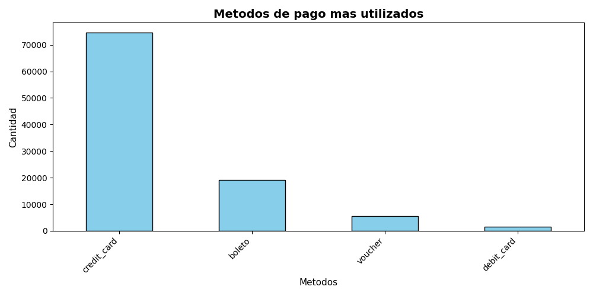
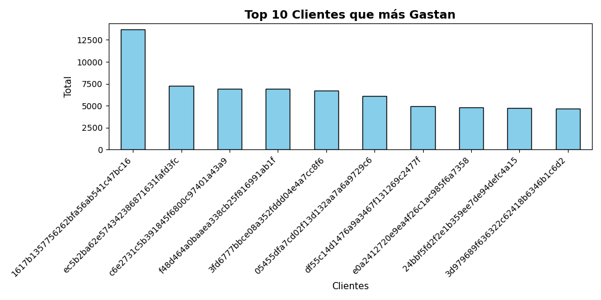
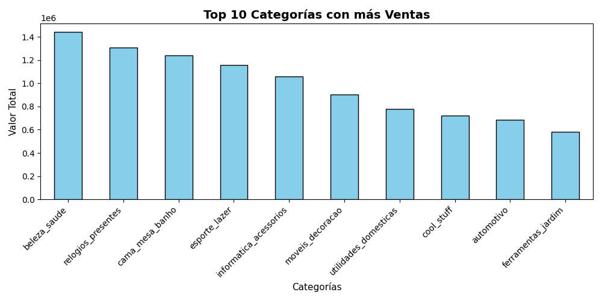
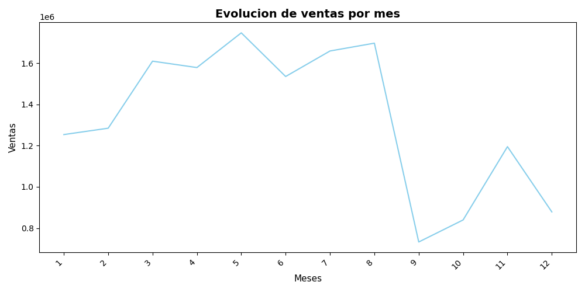
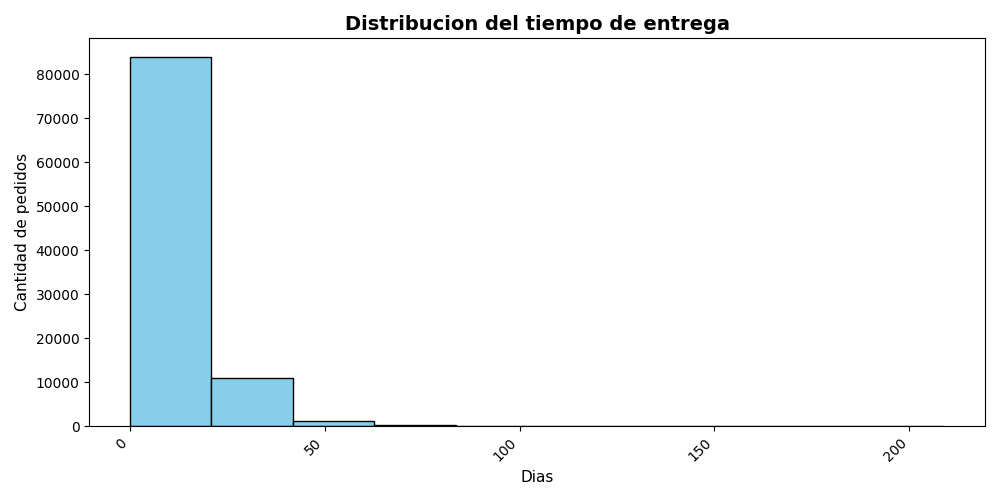
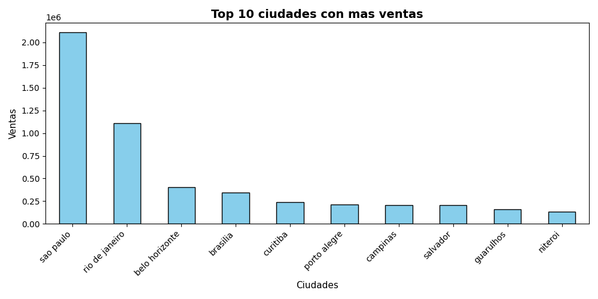

# Análisis de ventas - E-commerce Multitablas

## Descripción del Proyecto
Este proyecto consiste en el análisis de un dataset real de ventas de e-commerce (Olist, el e-commerce más grande de Brasil) utilizando Python y librerías de análisis de datos para trabajar con múltiples tablas interconectadas.

El objetivo principal fue unir la información dispersa en diferentes archivos para explorar las tendencias de consumo, identificar las categorías de productos más exitosas, descubrir los clientes con mayores gastos, evaluar el desempeño logístico analizando los tiempos de entrega y entender la distribución geográfica de las ventas.

---

## Tecnologías Utilizadas
- Python
- pandas
- matplotlib
- Jupyter notebook

## Dataset
El proyecto procesa un ecosistema multitabla que incluye información detallada de:
- **Clientes (`df` / `olist_customers_dataset.csv`):** Ubicación y códigos de identificación.
- **Pagos (`df3` / `olist_order_payments_dataset.csv`):** Métodos de pago, cuotas y montos cobrados.
- **Órdenes (`df6` / `olist_orders_dataset.csv`):** Fechas de compra, aprobación, entrega real y estimada, junto con los estados del pedido.
- **Ítems (`df4` / `olist_order_items_dataset.csv`):** Precios de productos, costos de flete y relaciones de envío.
- **Productos (`df7` / `olist_products_dataset.csv`):** Categorías, dimensiones y características físicas.

---

## Análisis realizados
Durante el proyecto se respondieron las siguientes preguntas de negocio mediante consultas y uniones de tablas:

1. ¿Cuáles son los métodos de pago más utilizados por los clientes?
2. ¿Qué clientes son los que representan un mayor gasto en la plataforma?
3. ¿Cuáles son las categorías de productos que más ingresos generaron (Valor total)?
4. ¿Cómo evoluciona el volumen total de ventas mes a mes?
5. ¿Cuál es la distribución del tiempo promedio que tardan las entregas en llegar al cliente?
6. ¿Cuáles son las ciudades o estados que concentran el mayor valor de ventas?

---

## Visualizaciones

### Métodos de pago más utilizados

---

### Top 10 Clientes con Mayor Gasto

---

### Top 10 Categorías que más Vendieron

---

### Evolución de ventas por mes

---

### Distribución del tiempo de entrega

---

### Top 10 ciudades con más ventas

---

## Conclusiones
- **Métodos de pago:** La gran mayoría de los usuarios prefiere pagar con tarjeta de crédito (`credit_card`), dejando a las demás opciones muy por detrás.
- **Mejores clientes:** Hay unos pocos clientes específicos cuyos gastos acumulados superan por mucho al comprador promedio de la plataforma.
- **Categorías estrella:** El mayor volumen de dinero e ingresos totales se concentra fuertemente en categorías clave de productos.
- **Comportamiento mensual:** La evolución temporal de las ventas muestra picos muy claros en ciertos meses del año, lo que ayuda a identificar la estacionalidad del negocio.
- **Tiempos de entrega:** El histograma revela que la mayoría de los pedidos se entregan en un rango de días bastante aceptable, aunque existen algunos casos aislados con demoras mayores.
- **Concentración geográfica:** Las ventas no están repartidas de forma pareja por todo el país; se concentran muchísimo en unas pocas ciudades principales (como Sao Paulo).

## Autor
Luciano De Marco